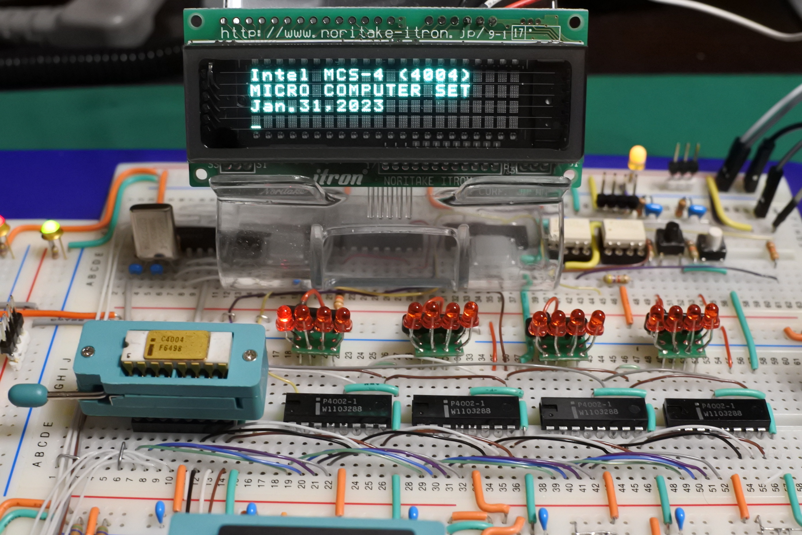
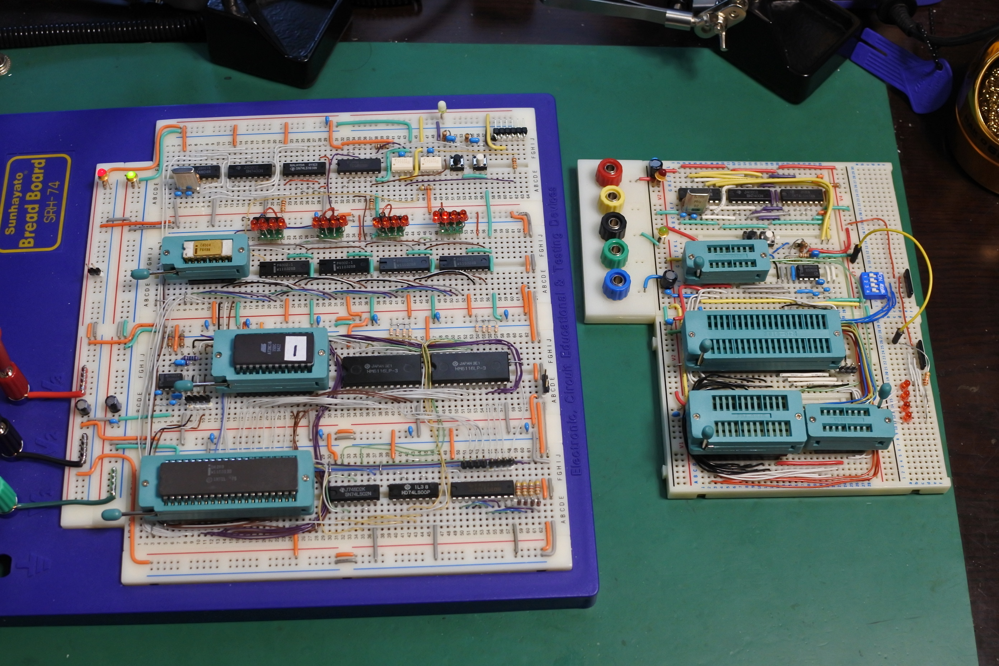

# test4004
Test board for Intel MCS-4 (4004)  micro computer set

This document is written mostly in Japanese.
If necessary, please use a translation service such as DeepL (I recommend this) or Google.

## 概要
2022年末に運良くIntel 4004を入手することができました．せっかくだから動かしてみようと思い，このプロジェクトを始めました．
現在進行中の未完成プロジェクトです．

## 作ったもの
- 4004実験用ボード
- シリアル通信用インターフェース
- 簡易モニター
- 電卓

## ToDO
- VTL的な言語(マンデルブロ集合を表示するぐらいのプログラムを実行させたい)
- プログラムメモリのRAM領域の拡大(現在の実装では256byteに制限されている)
- プリント基板作成

## ブログ
関連する情報が書いてあるかも．
- https://blog.goo.ne.jp/tk-80

## 参考にした文献，サイト
### 4004関連開発事例
- https://www.4004.com/
  - https://www.4004.com/busicom-replica.html
  - http://www.4004.com/2009/Busicom-141PF-Calculator_asm_rel-1-0-1.txt
- https://github.com/jim11662418/4004-SBC
- https://www.cpushack.com/mcs-4-test-boards-for-sale/
- https://github.com/novi/4004MainBoard

### データシート
- http://www.bitsavers.org/components/intel/
- https://www.intel-vintage.info/intelmcs.htm

### 開発環境
- http://john.ccac.rwth-aachen.de:8000/as/ (マクロアセンブラ)
